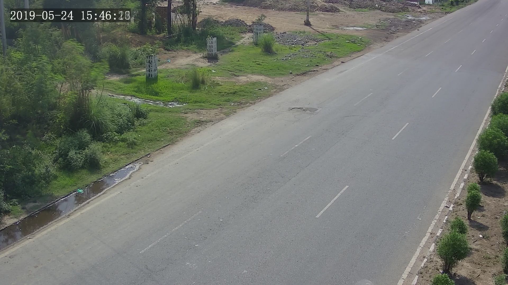

# Task write-up

## Requirements
- opencv module

## Steps to proceed
- First load the video [cut.mp4](https://github.com/anuragjain0610/synergy_task/blob/master/cut.mp4) into VideoCapture() funcion of openCV module.
- Then read each frame one by one using the object created in obove process and split it into Respective RGB channels.  
- Then take average of the respective channels of each frame individually using the concept of **Running Averages**. 
- Finally, merge the three different averaged channels of all the frames into a single image [output.jpg](https://github.com/anuragjain0610/synergy_task/blob/master/output.jpg).

## Running Average Technique
I have taken the total number of **frames_processed_so_far** times the **so_far_channel_average**, adding the respective channel of the current frame, and then dividing the result by the total number of **frames_processed_so_far + 1(for current_frame)**. And storing the final result in the respective RGB channel average arrays.

## References
[Long exposure with OpenCV and Python](https://www.pyimagesearch.com/2017/08/14/long-exposure-with-opencv-and-python/#:~:text=The%20averaging%20computation%20is%20quite,this%20is%20a%20fresh%20frame).

# Output of the task

